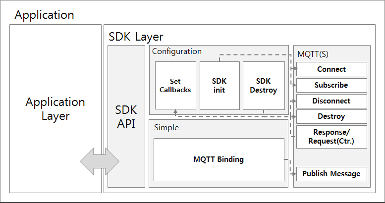

ThingPlug 2.0 Simple SDK
===
SKT ThingPlug 2.0 Simple SDK 구조와 API 및 사용법에 대한 내용입니다.

Architect
---


SDK Source Tree
---
	+ __middleware__ (middleware sample including makefiles for build)
	+ __lib__ (external libraries - paho, TLS, )
	+ __include__ (Header files of the ThingPlug Simple SDK)
	+ __src__ (Source files of the ThingPlug Simple SDK)
		+ __simple__ (Source files of the ThingPlug Simple API)
		+ __net__ (Source files of the MQTTS)
			
Description
---
Directory | Description
------------ | -------------
middleware |	SDK 를 이용한 미들웨어 샘플 폴더
lib | 외부 라이브러리나 소스들 폴더
include | SDK header 파일들 폴더
src | SDK source 파일들 폴더
simple | ThingPlug Simple API 소스 폴더
net | MQTT/TLS 관련 소스 폴더


Requirements
---

1. 최소 동작 환경
	+ CPU : ARM architecture / 100MHz
	+ RAM : 5MB
	+ Flash memory : 5MB

2. 테스트 환경
	+ Raspberry PI 2/3, BeagleBone-Black, Samsung ARTIK

Library
---
다음 오픈소스 라이브러리들을 사용합니다.

라이브러리 | 용도 | 홈페이지 | SDK포함여부
------------ | ------------- | ------------- | -------------
__cJSON__ | JSON parser | [cJSON Homepage](https://github.com/DaveGamble/cJSON) | 소스코드 형태로 SDK내에 포함됨
__paho__ | MQTT | [paho Homepage](https://eclipse.org/paho/) | prebuilt된 라이브러리 파일형태로 SDK내에 포함됨

Middleware build
===

Configuration 설정(samples/Configuration.h)
---
MQTT broker 와의 연결을 위한 정보 및 디바이스 정보를 설정해야 합니다.
```c
#define MQTT_HOST                           ""
#define MQTT_SECURE_HOST                    ""
#define MQTT_PORT                           1883
#define MQTT_SECURE_PORT                    8883						
#define MQTT_KEEP_ALIVE                     120
#define MQTT_ENABLE_SERVER_CERT_AUTH        0
#define LOGIN_NAME                          ""
#define LOGIN_PASSWORD                      ""
#define SIMPLE_SERVICE_NAME                 ""
#define SIMPLE_DEVICE_NAME                  ""
```

변수 | 값 | 용도 
------------ | ------------- | -------------
__MQTT_HOST__ | (TBD.) | ThingPlug 플랫폼 MQTT서버 주소
__MQTT_SECURE_HOST__ | (TBD.) | ThingPlug 플랫폼 MQTTS서버 주소
__LOGIN_NAME__ | ThingPlug 포털을 통해 디바이스 등록 후 발급받은 디바이스 토큰 | MQTT 로그인 사용자명으로 사용
__LOGIN_PASSWORD__ | (NULL) | 사용하지 않음
__SIMPLE_SERVICE_NAME__ | ThingPlug 포털을 통해 등록한 서비스명 | MQTT Topic 에 사용
__SIMPLE_DEVICE_NAME__ | ThingPlug 포털을 통해 등록한 디바이스명 | MQTT Topic 에 사용

ThingPlug_Simple_SDK 빌드(/Makefile)
---
1. 빌드

	```
	# make
	```
	

Middleware 예제 빌드(middleware/Makefile)
---
1. 빌드

	```
	# cd middleware
	# make
	```
	
2. 실행

	```
	# output/ThingPlug_Simple_SDK
	```
	